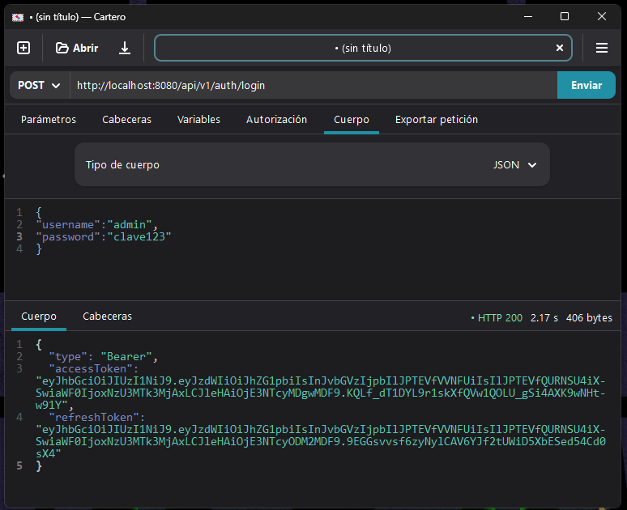
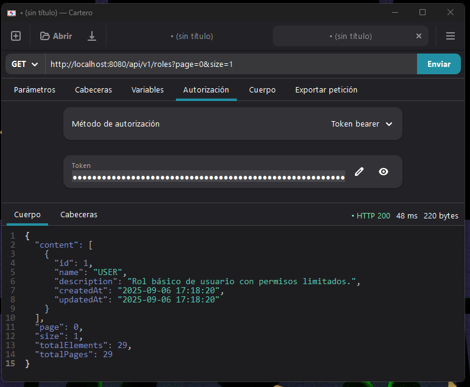
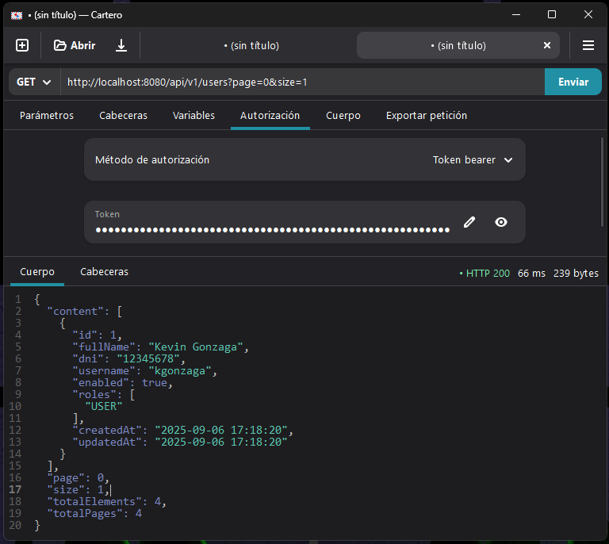
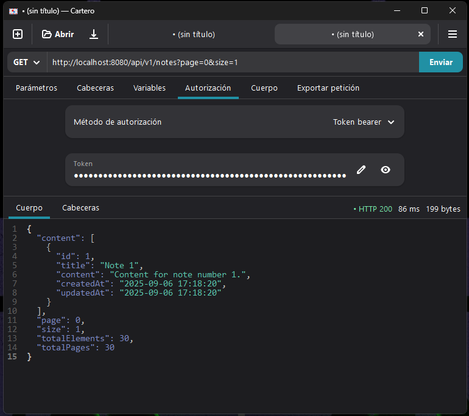
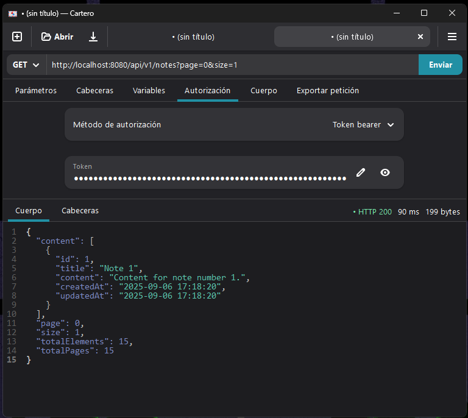

# 🗒️ Note App - Spring Boot

Aplicación demo CRUD de notas desarrollada con **Spring Boot**, que permite la gestión de usuarios, roles y notas, implementando autenticación y autorización basada en JWT. Este proyecto es ideal como ejemplo de arquitectura moderna con buenas prácticas de seguridad, validación y manejo de errores en Java.

## 🚀 Características principales

- ✅ Gestión de usuarios y roles.
- 📝 CRUD completo de notas.
- 🔐 Autenticación y autorización con JWT.
- 🔒 Seguridad con Spring Security.
- 🗃️ Persistencia con Spring Data JPA y base de datos H2.
- ✅ Validación de datos con Jakarta Validation.
- ⚠️ Manejo global de excepciones.
- 🕵️ Auditoría automática de entidades (createdAt, updatedAt).
- 🌐 Configuración de CORS para integración con frontend.

## 🛠️ Tecnologías utilizadas

- ☕ Java 21+
- 🌱 Spring Boot
- 🛡️ Spring Security
- 💾 Spring Data JPA
- 🔐 JWT (JSON Web Token)
- 🛠️ Lombok
- 🧪 Base de datos H2 en memoria


## 📁 Estructura del proyecto

```
src/
 └── main/
     ├── java/com/kgonzaga/note/app/
     │   ├── auth/...
     │   ├── config/...
     │   ├── exception/...
     │   ├── persistence/...
     │   ├── presentation/...
     │   ├── service/...
     │   └── util/...
     └── resources/
         ├── application.properties
         ├── data.sql
         └── schema.sql
```

## ⚙️ Instalación y ejecución

1. Clona el repositorio:
   ```bash
   git clone https://github.com/kgonzagao/note-backend.git
   cd note-app
   ```

2. Compila y ejecuta la aplicación:
   ```bash
   ./mvnw spring-boot:run
   ```
   o usando tu IDE favorito.

3. Accede a la consola H2 en [http://localhost:8080/h2-console](http://localhost:8080/h2-console)  
   (usuario: `sa`, sin contraseña por defecto).

## 📡 Endpoints

- `/api/v1/auth/register` - Registro de usuarios.
- `/api/v1/auth/login` - Autenticación de usuarios.
- `/api/v1/auth/refresh` - Actualizacion de Access Token.
- `/api/v1/auth/check-admin` - Verificación de usuarios administrador.
- `/api/v1/notes` - CRUD de notas.
- `/api/v1/users` - Gestión de usuarios.
- `/api/v1/roles` - Gestión de roles.

## 🤝 Contribuciones

¡Las contribuciones son bienvenidas! Por favor, abre un issue o un pull request para sugerencias o mejoras.

## 🙌 Créditos y agradecimientos

Este proyecto fue desarrollado como parte del curso de Udemy:

📘 [Master Completo en Java de cero a experto](https://www.udemy.com/course/master-completo-java-de-cero-a-experto/?couponCode=KEEPLEARNING)  
👨‍🏫 [Instructor: Andrés Guzmán](https://www.linkedin.com/in/andresguzf/)

## ⚖️ Licencia

Este proyecto está bajo la Licencia Apache 2.0.

---


## Vistas de la aplicación

### 🔐 Página de login


### 👥 Gestión de roles


### 👤 Gestión de usuarios


### 📝 Notas como la vista del administrador


### 📝 Notas como la vista del usuario

